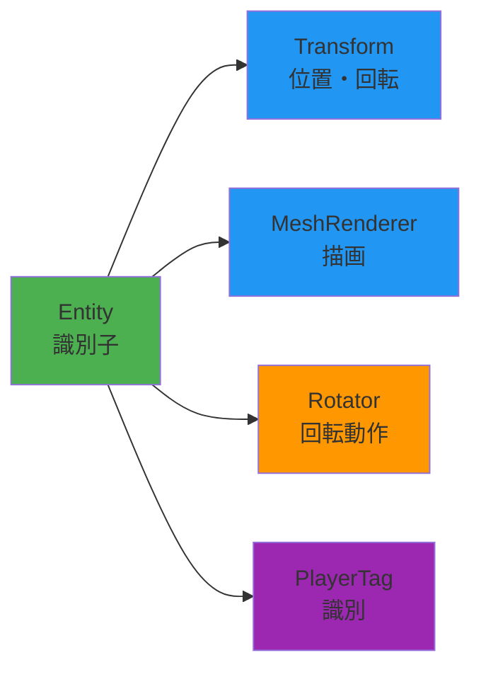
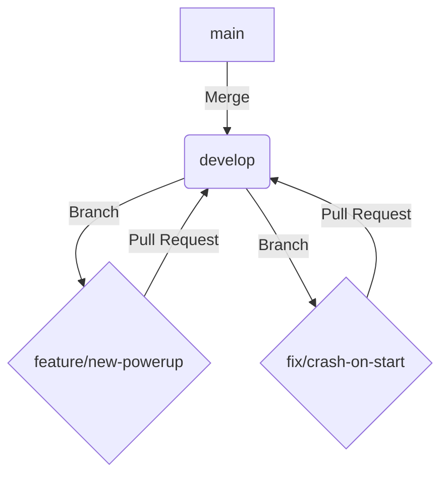

<div align="center">

# 🎮 HEW_ECS

### Entity Component System ゲーム開発フレームワーク

[](https://isocpp.org/)
[](https://docs.microsoft.com/en-us/windows/win32/directx)
[](https://www.microsoft.com/windows)
[](https://github.com/aptma-sHEWTeam/HEW_ECS)

**ECS（Entity Component System）アーキテクチャ**を活用した柔軟で拡張性の高いゲーム開発プロジェクト

[特徴](#-主な特徴) • [クイックスタート](#-クイックスタート) • [実装ガイド](#-実装ガイド) • [詳細ドキュメント](#-詳細ドキュメント)

</div>

---

## 📋目次

<details open>
<summary><b>主要セクション（クリックして展開/折りたたみ）</b></summary>

- [🎯 プロジェクト概要](#-プロジェクト概要)
- [✨ 主な特徴](#-主な特徴)
- [🚀 クイックスタート](#-クイックスタート)
- [🛠 環境構築](#-環境構築)
- [🔩 フレームワークの機能](#-フレームワークの機能)
- [📚 ECSアーキテクチャ入門](#-ecsアーキテクチャ入門)
- [🔧 実装ガイド](#-実装ガイド)
- [💡 実践例](#-実践例)
- [🐞 デバッグ方法](#-デバッグ方法)
- [📝 コーディング規約](#-コーディング規約)
- [📚 詳細ドキュメント](#-詳細ドキュメント)

</details>

<details>
<summary><b>補足情報（クリックして展開/折りたたみ）</b></summary>

- [👥 チーム開発ルール](#-チーム開発ルール)
- [🌟 GitHub初心者ガイド](#-github初心者ガイド)

</details>

---

## 🎯 プロジェクト概要

<table>
<tr>
<td width="50%">

**プロジェクト情報**

| 項目 | 内容 |
|------|------|
| **名称** | HEW_ECS (ECS_BACE) |
| **目的** | ECSを活用したチームゲーム開発 |
| **言語** | C++17 |
| **プラットフォーム** | Windows (DirectX11) |
| **アーキテクチャ** | Entity Component System |
| **チーム名** | はじけるポップコーン |

</td>
<td width="50%">

**プロジェクト統計**

```
📦 コンポーネント数:    15+
🎯 エンティティ管理:    動的
🔄 フレーム管理:       自動
📊 メモリ管理:         スマートポインタ
```

</td>
</tr>
</table>

---

## ✨ 主な特徴

<div align="center">

| 🎨 柔軟な設計 | ♻️ 再利用性 | 🔧 保守性 | 📈 拡張性 |
|:---:|:---:|:---:|:---:|
| コンポーネントの<br>組み合わせで機能実装 | 汎用コンポーネントを<br>複数のエンティティで共有 | 責任の分離により<br>バグ特定が容易 | 新しいコンポーネント追加で<br>機能拡張が可能 |

</div>

### 🌟 ECSの利点



---

## 🚀 クイックスタート

### ⚡ 30秒で始める

```cpp
// 1️⃣ ワールドを作成
World world;

// 2️⃣ エンティティを作成（ビルダーパターン）
Entity player = world.Create()
    .With<Transform>(DirectX::XMFLOAT3{0, 0, 0})
    .With<MeshRenderer>(DirectX::XMFLOAT3{0, 1, 0})
    .With<Rotator>(45.0f)
    .Build();

// 3️⃣ 毎フレーム更新
world.Tick(deltaTime);
```

> 💡 **たったこれだけ！** 回転する緑のキューブが画面に表示されます。
> <!-- TODO: ここに実行結果のGIFアニメーションを挿入 -->

---

## 🛠 環境構築

### 📋 必要な環境

<table>
<tr>
<td align="center" width="25%">

**💻 OS**

Windows 10/11

</td>
<td align="center" width="25%">

**🔨 IDE**

Visual Studio<br>2019/2022

</td>
<td align="center" width="25%">

**📦 SDK**

Windows SDK<br>(DirectX 11)

</td>
<td align="center" width="25%">

**C++**

C++17

</td>
</tr>
</table>

### 📥 インストール手順

```bash
# 1️⃣ リポジトリをクローン
git clone https://github.com/aptma-sHEWTeam/HEW_ECS.git

# 2️⃣ ディレクトリに移動
cd HEW_ECS

# 3️⃣ Visual Studioでソリューションを開く
start HEW_GAME.sln
```

### ▶️ ビルド & 実行

| 操作 | ショートカット |
|------|---------------|
| ビルド | `F7` または `Ctrl+Shift+B` |
| 実行（デバッグ） | `F5` |
| 実行（非デバッグ） | `Ctrl+F5` |

### 📦 依存ライブラリについて

本プロジェクトで利用する主要なライブラリは、リポジトリに同梱されているか、ビルドプロセスで自動的に解決されます。

- **Assimp (Open Asset Import Library)**
  - 3Dモデルを読み込むためのライブラリです。
  - `libs/assimp-6.0.2` に必要なファイルが同梱されており、プロジェクトに直接リンクされています。
  - ユーザー側で個別のインストール作業は不要です。

- **NuGet パッケージ**
  - GitHub ActionsでのCI/CDパイプラインでは `nuget restore` コマンドが実行されます。
  - 現時点では明示的な追加パッケージはありませんが、将来的にライブラリを追加した場合は、この仕組みによって自動的に依存関係が解決されます。

---

## 🔩 フレームワークの機能

このフレームワークには、ゲーム開発をすぐに始められるように、基本的なコンポーネントとシステムが予め用意されています。

### 主要コンポーネント一覧

| 種類 | コンポーネント名 | 主要プロパティ / 使い方 |
|:---|:---|:---|
| 📦 **データ** | `Transform` | `XMFLOAT3 position`<br>`XMFLOAT3 rotation`<br>`XMFLOAT3 scale` |
| | `MeshRenderer` | `MeshType meshType` (Cube, Sphere, ...)<br>`XMFLOAT3 color`<br>`TextureHandle texture` |
| | `ModelComponent`| `ComPtr<ID3D11Buffer> vertexBuffer`<br>`UINT indexCount`<br>*(ModelLoadingSystemが自動で設定)* |
| | `Health` | `float current`, `float max`<br>`TakeDamage(float)`, `IsDead()` |
| | `Velocity` | `XMFLOAT3 velocity` |
| | `DirectionalLight` | `XMFLOAT3 direction`<br>`XMFLOAT4 color` |
| ⚙️ **Behaviour** | `Rotator` | `float speedDegY` (Y軸周りの回転速度) |
| | `PlayerMovement` | `float speed`<br>*(入力は自動で処理)* |
| 🏷️ **タグ** | `PlayerTag`<br>`EnemyTag`<br>`BulletTag` | *エンティティを識別するためのマーカー。プロパティは持たない。*<br>`world.ForEach<PlayerTag>(...)`のように使う。 |

### 主要システム一覧

| システム名 | 概要 |
|:---|:---|
| `ModelLoadingSystem` | `Model`コンポーネントを持つエンティティに対し、リソースマネージャーから3Dモデルデータを非同期的に読み込み、`ModelComponent`としてアタッチします。 |

---

## 📚 ECSアーキテクチャ入門

<div align="center">

### 🏗️ ECSの3要素

```
┌─────────────┐     ┌─────────────────┐     ┌──────────────┐
│   Entity    │────▶│   Component     │────▶│   System     │
│  (識別子)    │     │ (データ・動作)   │     │  (処理)      │
└─────────────┘     └─────────────────┘     └──────────────┘
      ID                データ保持               ロジック実行
```

</div>

### 1️⃣ Entity（エンティティ）

> **一意なID（識別子）のみを持つオブジェクト**

```cpp
struct Entity {
    uint32_t id;   // エンティティID
    uint32_t gen;  // 世代番号（削除時に使用）
};
```

<details>
<summary>📖 詳細を見る</summary>

- ✅ データやロジックは一切持たない
- ✅ コンポーネントの「入れ物」として機能
- ✅ 例: プレイヤー、敵、弾丸、アイテムなど

**特徴**
- **軽量**: IDと世代番号のみ
- **安全**: 世代番号で古いハンドルを無効化
- **柔軟**: コンポーネントの組み合わせで機能定義

</details>

---

### 2️⃣ Component（コンポーネント）

> **データまたは動作を表す部品**

#### 📦 データコンポーネント（IComponent継承）

データのみを保持し、ロジックは含まない

```cpp
struct Transform : IComponent {
    DirectX::XMFLOAT3 position{0, 0, 5};  // 位置
    DirectX::XMFLOAT3 rotation{0, 0, 0};  // 回転
    DirectX::XMFLOAT3 scale{1, 1, 1};     // スケール
};
```

#### ⚙️ Behaviourコンポーネント（Behaviour継承）

毎フレーム更新されるロジックを持つ

```cpp
struct Rotator : Behaviour {
    float speedDegY = 45.0f;  // 回転速度（度/秒）
    
    void OnUpdate(World& w, Entity self, float dt) override {
        auto* t = w.TryGet<Transform>(self);
        if (t) {
            t->rotation.y += speedDegY * dt;
        }
    }
};
```

---

### 3️⃣ System（システム）

> **コンポーネントに対する処理ロジック**

#### 方法1: Behaviourパターン（推奨）

```cpp
struct MyBehaviour : Behaviour {
    void OnStart(World& w, Entity self) override {
        // 初回起動時に1度だけ実行
    }
    
    void OnUpdate(World& w, Entity self, float dt) override {
        // 毎フレーム実行される処理
    }
};
```

#### 方法2: ForEachパターン

```cpp
void UpdateMovementSystem(World& world, float dt) {
    world.ForEach<Transform, Velocity>([dt](Entity e, Transform& t, Velocity& v) {
        t.position.x += v.velocity.x * dt;
        t.position.y += v.velocity.y * dt;
        t.position.z += v.velocity.z * dt;
    });
}
```

---

## 🔧 実装ガイド

ここでは、独自のコンポーネントやエンティティを作成する方法を解説します。

### コンポーネントの作り方

<table>
<tr>
<td width="50%">

**📦 データコンポーネント**

```cpp
struct Health : IComponent {
    float current = 100.0f;
    float max = 100.0f;
    
    void TakeDamage(float dmg) {
        current -= dmg;
        if (current < 0.0f) 
            current = 0.0f;
    }
    
    bool IsDead() const {
        return current <= 0.0f;
    }
};
```

</td>
<td width="50%">

**⚙️ Behaviourコンポーネント**

```cpp
struct Bouncer : Behaviour {
    float speed = 2.0f;
    float amplitude = 2.0f;
    float time = 0.0f;
    
    void OnUpdate(World& w, 
                  Entity self, 
                  float dt) override {
        time += dt * speed;
        auto* t = w.TryGet<Transform>(self);
        if (t) {
            t->position.y = 
                startY + sinf(time) * amplitude;
        }
    }
};
```

</td>
</tr>
</table>

### エンティティの作成

**メソッドチェーンで直感的にコンポーネントを追加できるビルダーパターンが推奨です。**

```cpp
Entity player = world.Create()
    .With<Transform>(DirectX::XMFLOAT3{0, 0, 0})
    .With<MeshRenderer>(DirectX::XMFLOAT3{0, 1, 0})
    .With<Rotator>(45.0f)
    .With<PlayerTag>()
    .Build();  // ← .Build()は省略可能
```

---

## 💡 実践例

### 例1: シンプルな回転キューブ 🎲

```cpp
Entity CreateRotatingCube(World& world) {
    return world.Create()
        .With<Transform>(DirectX::XMFLOAT3{0, 0, 0})
        .With<MeshRenderer>(DirectX::XMFLOAT3{1, 0, 0})  // 赤色
        .With<Rotator>(90.0f)  // 90度/秒で回転
        .Build();
}
```

### 例2: プレイヤーキャラクター 🎮

```cpp
// プレイヤーの移動を処理するBehaviour
struct PlayerMovement : Behaviour {
    InputSystem* input_ = nullptr;
    float speed = 5.0f;
    
    void OnUpdate(World& w, Entity self, float dt) override {
        auto* t = w.TryGet<Transform>(self);
        if (!t || !input_) return;
        
        if (input_->GetKey('W')) t->position.z += speed * dt;
        if (input_->GetKey('S')) t->position.z -= speed * dt;
        if (input_->GetKey('A')) t->position.x -= speed * dt;
        if (input_->GetKey('D')) t->position.x += speed * dt;
n    }
};

// プレイヤーを生成する関数
Entity CreatePlayer(World& world, InputSystem* input) {
    Entity player = world.Create()
        .With<Transform>()
        .With<MeshRenderer>({0, 1, 0}) // 緑色
        .With<PlayerTag>()
        .Build();
    
    // Behaviourは後から追加して設定を渡すことも可能
    auto& movement = world.Add<PlayerMovement>(player);
    movement.input_ = input;
    
    return player;
}
```

### 例3: コンポーネントの取得と変更 🔍

```cpp
// ✅ 安全な取得（TryGet推奨）
auto* transform = world.TryGet<Transform>(entity);
if (transform) {
    transform->position.x += 1.0f;
}

// ✅ 存在確認
if (world.Has<Health>(entity)) {
    auto* health = world.TryGet<Health>(entity);
    health->TakeDamage(10.0f);
}
```

---

## 🐞 デバッグ方法

開発中に問題が発生した場合、以下のデバッグ機能が役立ちます。

### ログ出力 (`debug_log.txt`)

デバッグビルドでアプリケーションを実行すると、実行ファイルと同じ階層に `debug_log.txt` が生成されます。これには、システムの初期化、エンティティの生成/破棄、警告、エラーなど、アプリケーションの動作に関する詳細なログが記録されます。

独自のログを出力するには、`DEBUGLOG()` マクロを使用します。

```cpp
#include "app/DebugLog.h"

void MyFunction() {
    DEBUGLOG("MyFunctionが呼び出されました");
    
    // カテゴリを指定して、ログをフィルタリングしやすくすることも可能
    DEBUGLOG_CATEGORY(DebugLog::Category::Input, "入力処理を開始");
}
```

### デバッグ描画 (`DebugDraw`)

デバッグビルドでは、シーン内にグリッドと座標軸が自動的に描画されます。これに加えて、任意の線や図形をシーンに描画して、当たり判定の範囲やオブジェクトの進行方向などを視覚化できます。

`DebugDraw` システムは `ServiceLocator` に登録されているため、どこからでもアクセス可能です。

```cpp
#include "graphics/DebugDraw.h"
#include "app/ServiceLocator.h"

void DrawCollisionBox(const BoundingBox& box) {
    auto& dd = ServiceLocator::Get<DebugDraw>();
    
    // BoundingBoxをワイヤーフレームで描画
    dd.AddBox(box.Center, box.Extents, DirectX::XMFLOAT3{1.0f, 0.0f, 0.0f}); // 赤色
}
```

---

## 📝 コーディング規約

プロジェクトのコード品質と一貫性を保つため、以下の規約に従ってください。コードフォーマットは `.clang-format` ファイルによって定義されており、`tools/Run-ClangFormat.ps1` を実行することで自動的に整形できます。

### 🎨 コードフォーマット (Clang-Format)

- **ベーススタイル**: `Microsoft` スタイルを基本とします。
- **インデント**: `スペース4つ` を使用します（タブは使用しません）。
- **波括弧 `{}`**: `if` や `for` などの制御構文の直後で改行せず、同じ行に記述します (Attachスタイル)。
- **ポインタ/参照の揃え**: `*` や `&` は、型名の左側ではなく、変数名の右側に配置します。

### 🏷️ 命名規約

<div align="center">

| 要素 | 規約 | 例 |
|:----:|:----:|:--:|
| **クラス名** | PascalCase | `Transform`, `MeshRenderer` |
| **関数名** | PascalCase | `CreateEntity`, `TryGet` |
| **変数名** | camelCase | `deltaTime`, `entityId` |
| **メンバ変数** | camelCase + `_` | `world_`, `nextId_` |
| **定数** | UPPER_SNAKE_CASE | `MAX_ENTITIES` |

</div>

### 📚 C++17準拠

本プロジェクトは **C++17** に準拠して開発されています。
C++17で導入された機能（構造化束縛、`if constexpr`、`std::optional`など）を積極的に活用してください。

> ⚠️ **注意**: `.clang-format`ファイルでは`Standard: c++14`と設定されていますが、これはフォーマッタのスタイル設定であり、**プロジェクトのビルド設定（C++17）が正**です。C++17の構文を使用しても問題ありません。

---

## 📚 詳細ドキュメント

特定の機能に関するより詳細なガイドやリファレンスは、`docs`フォルダに格納されています。

| ドキュメント | 概要 |
|:---|:---|
| [**Core_Architecture.md**](./docs/Core_Architecture.md) | **フレームワーク全体の設計思想と内部実装を解説した最重要ドキュメントです。** |
| [ChargeSystem_Guide.md](./docs/ChargeSystem_Guide.md) | 「溜め」動作を実装するためのチャージシステムの詳細なガイドです。 |
| [ChargeSystem_QuickRef.md](./docs/ChargeSystem_QuickRef.md) | チャージシステムのAPIや使い方をまとめたクイックリファレンスです。 |
| [DebugDraw_Improvements.md](./docs/DebugDraw_Improvements.md) | デバッグ描画機能の改善に関する提案やアイデアが記載されています。 |
| [GamepadSystem_README.md](./docs/GamepadSystem_README.md) | ゲームパッド入力システムのセットアップ方法や使用例を解説しています。 |
| [RealtimeCharge_Guide.md](./docs/RealtimeCharge_Guide.md) | リアルタイムでのチャージ処理に関する実装ガイドです。 |
| [RenderSystem_Improvements.md](./docs/RenderSystem_Improvements.md) | レンダリングシステムの改善に関する技術的な詳細や計画が記載されています。 |

---

## 👥 チーム開発ルール

### 📂 ファイル編集の優先順位

#### 🔒 コアシステム（触らない）

> ⚠️ **注意**: 以下のファイルは**変更する場合はチーム全体で相談**

```
include/ecs/World.h           # ECSコアシステム
include/ecs/Entity.h          # エンティティ定義
include/components/Component.h # コンポーネント基底クラス
include/components/Transform.h # Transform定義
```

#### ✅ 自由に編集可能

```
include/scenes/              # ゲームシーンの実装
include/components/Custom*.h # カスタムコンポーネント
src/                        # 実装ファイル
```

#### ⚠️ 要相談

```
include/graphics/  # グラフィックスシステム
include/input/     # 入力システム
include/app/       # アプリケーション基盤
```

---

### 🔀 Git/GitHubのルール

本プロジェクトでは、Git-flowに基づいたシンプルなブランチモデルを採用します。

- **`main` / `master` ブランチ**
  - 常に安定し、リリース可能な状態を保ちます。
  - このブランチへの直接のプッシュは禁止です。`develop`ブランチからのPull Requestによってのみマージされます。

- **`develop` ブランチ**
  - 開発のメインとなるブランチです。
  - 新機能の追加やバグ修正が完了したら、このブランチにマージします。

- **フィーチャー / バグ修正ブランチ**
  - 新しい機能を追加する場合: `develop`から`feature/機能名`という名前でブランチを作成します。（例: `feature/player-jump`）
  - バグを修正する場合: `develop`から`fix/修正内容`という名前でブランチを作成します。（例: `fix/collision-bug`）
  - 作業が完了したら、`develop`ブランチへのPull Requestを作成してください。



---

## 🌟 GitHub初心者ガイド

<div align="center">

### 🤔 GitHubって何？

**GitHub**は、プログラムのソースコードを保存・管理・共有できるオンラインサービスです。  
チームで開発する際に、**誰がいつどこを変更したか**を記録し、**複数人が同時に作業しても混乱しない**ようにしてくれます。

</div>

---

### 📖 重要な用語集（初心者向け）

<table>
<tr>
<th width="25%">用語</th>
<th width="75%">説明</th>
</tr>
<tr>
<td><b>🗂️ リポジトリ<br>(Repository)</b></td>
<td>プロジェクトのファイルを保存する場所。<b>プロジェクトフォルダ</b>のようなもの。<br>例: <code>HEW_ECS</code> がこのプロジェクトのリポジトリ</td>
</tr>
<tr>
<td><b>📥 クローン<br>(Clone)</b></td>
<td>GitHub上のリポジトリを<b>自分のパソコンにコピー</b>すること。<br>ダウンロードのようなもの（ただし履歴情報も含む）</td>
</tr>
<tr>
<td><b>💾 コミット<br>(Commit)</b></td>
<td>変更を<b>記録する</b>こと。セーブポイントのようなもの。<br>「何を変更したか」のメッセージも記録する</td>
</tr>
<tr>
<td><b>📤 プッシュ<br>(Push)</b></td>
<td>自分のパソコンの変更を<b>GitHub（サーバー）にアップロード</b>すること</td>
</tr>
<tr>
<td><b>📥 プル<br>(Pull)</b></td>
<td>GitHub（サーバー）の最新の変更を<b>自分のパソコンにダウンロード</b>すること</td>
</tr>
<tr>
<td><b>🏠 master/main<br>ブランチ</b></td>
<td>プロジェクトの<b>本番用</b>のブランチ。完成したコードが入る。<br>ペアプログラミングでは、このブランチで直接作業します</td>
</tr>
</table>

---

### 🚀 完全ステップバイステップガイド

---

## ステップ1️⃣: Gitのインストール

### Windowsの場合

1. **Git for Windows**をダウンロード  
   👉 https://git-scm.com/download/win

2. インストーラーを実行（基本的に全て「Next」で進めてOK）

3. インストール確認  
   ```bash
   # コマンドプロンプトまたはPowerShellを開く
   git --version
   ```
   
   ✅ `git version 2.x.x` のように表示されればOK

---

## ステップ2️⃣: GitHubアカウントの設定

### 初回のみ必要な設定

```bash
# 1. ユーザー名を設定（GitHubのユーザー名を入力）
git config --global user.name "あなたのGitHubユーザー名"

# 2. メールアドレスを設定（GitHubのメールアドレスを入力）
git config --global user.email "your.email@example.com"

# 3. 設定確認
git config --list
```

**例:**
```bash
git config --global user.name "YamaYamamoto"
git config --global user.email "yama@example.com"
```

---

## ステップ3️⃣: リポジトリをクローン（初回のみ）

### 3-1. クローンする場所を決める

```bash
# 例: デスクトップに移動
cd Desktop

# または Documents フォルダに移動
cd Documents

# 現在のフォルダを確認
pwd
```

### 3-2. GitHubからクローン

```bash
# HEW_ECSリポジトリをクローン
git clone https://github.com/aptma-sHEWTeam/HEW_ECS.git

# クローンしたフォルダに移動
cd HEW_ECS
```

<div align="center">

✅ **成功すると**:

```
Cloning into 'HEW_ECS'...
remote: Enumerating objects: 1234, done.
remote: Counting objects: 100% (1234/1234), done.
Unpacking objects: 100% (1234/1234), done.
```

</div>

---

## 🆘 トラブルシューティング

### ❓ よくあるエラーと解決方法

<details>
<summary><b>エラー: "fatal: not a git repository"</b></summary>

**原因**: Gitリポジトリではないフォルダで実行した

**解決策**:
```bash
# HEW_ECSフォルダに移動しているか確認
cd HEW_ECS

# または、再度クローン
git clone https://github.com/aptma-sHEWTeam/HEW_ECS.git
cd HEW_ECS
```

</details>

<details>
<summary><b>エラー: "error: Your local changes would be overwritten"</b></summary>

**原因**: 変更をコミットせずにプルしようとした

**解決策**:
```bash
# 変更をコミット
git add .
git commit -m "💾 Save work in progress"

# 再度プル
git pull origin master
```

</details>

<details>
<summary><b>エラー: "rejected - non-fast-forward"</b></summary>

**原因**: GitHub上に自分の持っていない変更がある

**解決策**:
```bash
# 1. 最新の変更を取得
git pull origin master

# 2. コンフリクトがあれば解決←わかんなければ私まで

# 3. 再度プッシュ
git push origin master
```

</details>

<details>
<summary><b>問題: "間違えたファイルをコミットしてしまった"</b></summary>

**解決策（プッシュ前）**:
```bash
# 最後のコミットを取り消し（変更は残る）
git reset --soft HEAD~1

# 正しいファイルのみ追加
git add 正しいファイル
git commit -m "✨ 正しいコミット"
```

**解決策（プッシュ済み）**:
```bash
# 新しいコミットで修正
git rm 間違えたファイル
git commit -m "🔥 Remove accidentally committed file"
git push origin master
```

</details>

<details>
<summary><b>問題: "前のバージョンに戻したい※誰かに相談してほしい"</b></summary>

**解決策**:
```bash
# 1. コミット履歴を確認
git log --oneline

# 例:
# def5678 ✨ Add player shoot
# abc1234 ✨ Add player jump
# 9876543 🐛 Fix collision bug

# 2. 戻りたいコミットのハッシュをコピー（例: abc1234）

# 3. そのコミットに戻る（変更は破棄される）
git reset --hard abc1234

# 4. 強制的にプッシュ（⚠️注意: 全員に必ず伝える）
git push origin master --force
```

⚠️ **注意**: `--force`を使うと履歴が書き換わるため、必ず誰かに確認してください。

</details>

---

## 📋 コマンド一覧

<table>
<tr>
<th width="40%">コマンド</th>
<th width="60%">説明</th>
</tr>
<tr>
<td><code>git status</code></td>
<td>現在の状態を確認（変更されたファイルなど）</td>
</tr>
<tr>
<td><code>git add .</code></td>
<td>全ての変更をステージング</td>
</tr>
<tr>
<td><code>git add ファイル名</code></td>
<td>特定のファイルをステージング</td>
</tr>
<tr>
<td><code>git commit -m "メッセージ"</code></td>
<td>変更をコミット</td>
</tr>
<tr>
<td><code>git pull origin master</code></td>
<td>GitHub上の最新を取得</td>
</tr>
<tr>
<td><code>git push origin master</code></td>
<td>GitHubにプッシュ</td>
</tr>
<tr>
<td><code>git log</code></td>
<td>コミット履歴を表示</td>
</tr>
<tr>
<td><code>git log --oneline</code></td>
<td>コミット履歴を1行で表示</td>
</tr>
<tr>
<td><code>git diff</code></td>
<td>変更内容を表示</td>
</tr>
<tr>
<td><code>git reset --soft HEAD~1</code></td>
<td>最後のコミットを取り消し（変更は残す）</td>
</tr>
<tr>
<td><code>git reset --hard HEAD~1</code></td>
<td>最後のコミットを取り消し（変更も破棄）</td>
</tr>
</table>

---

## 🎓 さらに学習するには

### 📚 推奨リソース

| リソース | URL |
|---------|-----|
| **Git公式ドキュメント（日本語）** | https://git-scm.com/book/ja/v2 |
| **GitHub公式ガイド** | https://docs.github.com/ja |
| **サル先生のGit入門** | https://backlog.com/ja/git-tutorial/ |
| **わかばちゃんと学ぶ Git使い方入門←オヌヌメ** | （書籍・Kindle版あり） |

---

## ✅ チェックリスト（作業前）

```
開発開始前に必ず確認:

□ 最新のmasterブランチを取得した（git pull origin master）
□ Visual Studioでビルドが通る
□ ペアの人に作業内容を伝えた
□ コンフリクトがないことを確認した
```

---

## ✅ チェックリスト（作業後）

```
masterにプッシュする前に必ず確認:

□ ビルドエラーがない（Debug/Release両方）
□ コミットメッセージが明確
□ 不要なファイル（.obj, .exe など）をコミットしていない
□ コメントアウトされたコードを削除した
□ デバッグ用のprintfを削除した
□ 他のメンバーの作業に影響しない
□ README更新が必要な場合は更新した
□ ペアの人にレビューしてもらった
□ プッシュ前に再度 git pull した
```

---

## ⚠️ 著作権について

このプロジェクトのソースコードおよび関連資料は、著作権法によって保護されています。 
無断での使用、複製、改変、再配布を禁止します。 
著作権者: **はじけるポップコーン**

---