<div align="center">

# 🎮 HEW_ECS

### Entity Component System ゲーム開発フレームワーク

[](https://isocpp.org/)
[](https://docs.microsoft.com/en-us/windows/win32/directx)
[](https://www.microsoft.com/windows)
[](LICENSE)
[](https://github.com/aptma-sHEWTeam/HEW_ECS)

**ECS（Entity Component System）アーキテクチャ**を活用した柔軟で拡張性の高いゲーム開発プロジェクト

[特徴](#-主な特徴) • [クイックスタート](#-クイックスタート) • [ドキュメント](#-目次) • [サンプル](#-実践例)

</div>

---

## 📋 目次

<details open>
<summary><b>クリックして展開/折りたたみ</b></summary>

- [🎯 プロジェクト概要](#-プロジェクト概要)
- [✨ 主な特徴](#-主な特徴)
- [🚀 クイックスタート](#-クイックスタート)
- [🛠 環境構築](#-環境構築)
- [📚 ECSアーキテクチャ入門](#-ecsアーキテクチャ入門)
- [🔧 コンポーネントの作り方](#-コンポーネントの作り方)
- [🎮 エンティティの作成](#-エンティティの作成)
- [💡 実践例](#-実践例)
- [📝 コーディング規約](#-コーディング規約)
- [👥 チーム開発ルール](#-チーム開発ルール)
- [📖 参考資料](#-参考資料)

</details>

---

## 🎯 プロジェクト概要

<table>
<tr>
<td width="50%">

**プロジェクト情報**

| 項目 | 内容 |
|------|------|
| **名称** | HEW_ECS (ECS_BACE) |
| **目的** | ECSを活用したチームゲーム開発 |
| **言語** | C++14 |
| **プラットフォーム** | Windows (DirectX 11) |
| **アーキテクチャ** | Entity Component System |

</td>
<td width="50%">

**プロジェクト統計**

```
📦 コンポーネント数:    15+
🎯 エンティティ管理:    動的
🔄 フレーム管理:       自動
📊 メモリ管理:         スマートポインタ
```

</td>
</tr>
</table>

---

## ✨ 主な特徴

<div align="center">

| 🎨 柔軟な設計 | ♻️ 再利用性 | 🔧 保守性 | 📈 拡張性 |
|:---:|:---:|:---:|:---:|
| コンポーネントの<br>組み合わせで機能実装 | 汎用コンポーネントを<br>複数のエンティティで共有 | 責任の分離により<br>バグ特定が容易 | 新しいコンポーネント追加で<br>機能拡張が可能 |

</div>

### 🌟 ECSの利点

```mermaid
graph LR
    A[Entity<br>識別子] --> B[Transform<br>位置・回転]
    A --> C[MeshRenderer<br>描画]
    A --> D[Rotator<br>回転動作]
    A --> E[PlayerTag<br>識別]
    
    style A fill:#4CAF50
    style B fill:#2196F3
    style C fill:#2196F3
    style D fill:#FF9800
    style E fill:#9C27B0
```



---

## 🚀 クイックスタート

### ⚡ 30秒で始める

```cpp
// 1️⃣ ワールドを作成
World world;

// 2️⃣ エンティティを作成（ビルダーパターン）
Entity player = world.Create()
    .With<Transform>(DirectX::XMFLOAT3{0, 0, 0})
    .With<MeshRenderer>(DirectX::XMFLOAT3{0, 1, 0})
    .With<Rotator>(45.0f)
    .Build();

// 3️⃣ 毎フレーム更新
world.Tick(deltaTime);
```

> 💡 **たったこれだけ！** 回転する緑のキューブが画面に表示されます。

---

## 🛠 環境構築

### 📋 必要な環境

<table>
<tr>
<td align="center" width="25%">

**💻 OS**

Windows 10/11

</td>
<td align="center" width="25%">

**🔨 IDE**

Visual Studio<br>2019/2022

</td>
<td align="center" width="25%">

**📦 SDK**

Windows SDK<br>(DirectX 11)

</td>
<td align="center" width="25%">

**📚 C++**

C++14

</td>
</tr>
</table>

### 📥 インストール手順

```bash
# 1️⃣ リポジトリをクローン
git clone https://github.com/aptma-sHEWTeam/HEW_ECS.git

# 2️⃣ ディレクトリに移動
cd HEW_ECS

# 3️⃣ Visual Studioでソリューションを開く
start ECS_BACE.sln
```

### ▶️ ビルド & 実行

| 操作 | ショートカット |
|------|---------------|
| ビルド | `F7` または `Ctrl+Shift+B` |
| 実行（デバッグ） | `F5` |
| 実行（非デバッグ） | `Ctrl+F5` |

---

## 📚 ECSアーキテクチャ入門

<div align="center">

### 🏗️ ECSの3要素

```
┌─────────────┐     ┌─────────────────┐     ┌──────────────┐
│   Entity    │────▶│   Component     │────▶│   System     │
│  (識別子)    │     │ (データ・動作)   │     │  (処理)      │
└─────────────┘     └─────────────────┘     └──────────────┘
      ID                データ保持               ロジック実行
```

</div>

### 1️⃣ Entity（エンティティ）

> **一意なID（識別子）のみを持つオブジェクト**

```cpp
struct Entity {
    uint32_t id;   // エンティティID
    uint32_t gen;  // 世代番号（削除時に使用）
};
```

<details>
<summary>📖 詳細を見る</summary>

- ✅ データやロジックは一切持たない
- ✅ コンポーネントの「入れ物」として機能
- ✅ 例: プレイヤー、敵、弾丸、アイテムなど

**特徴**
- **軽量**: IDと世代番号のみ
- **安全**: 世代番号で古いハンドルを無効化
- **柔軟**: コンポーネントの組み合わせで機能定義

</details>

---

### 2️⃣ Component（コンポーネント）

> **データまたは動作を表す部品**

#### 📦 データコンポーネント（IComponent継承）

データのみを保持し、ロジックは含まない

```cpp
struct Transform : IComponent {
    DirectX::XMFLOAT3 position{0, 0, 5};  // 位置
    DirectX::XMFLOAT3 rotation{0, 0, 0};  // 回転
    DirectX::XMFLOAT3 scale{1, 1, 1};     // スケール
};
```

<details>
<summary>📦 その他のデータコンポーネント例</summary>

```cpp
// 体力管理
struct Health : IComponent {
    float current = 100.0f;
    float max = 100.0f;
};

// 速度ベクトル
struct Velocity : IComponent {
    DirectX::XMFLOAT3 velocity{0, 0, 0};
};

// スコア
DEFINE_DATA_COMPONENT(Score,
    int points = 0;
);
```

</details>

#### ⚙️ Behaviourコンポーネント（Behaviour継承）

毎フレーム更新されるロジックを持つ

```cpp
struct Rotator : Behaviour {
    float speedDegY = 45.0f;  // 回転速度（度/秒）
    
    void OnUpdate(World& w, Entity self, float dt) override {
        auto* t = w.TryGet<Transform>(self);
        if (t) {
            t->rotation.y += speedDegY * dt;
        }
    }
};
```

<details>
<summary>⚙️ その他のBehaviour例</summary>

```cpp
// 上下に跳ねる動き
struct Bouncer : Behaviour {
    float speed = 2.0f;
    float amplitude = 2.0f;
    
    void OnUpdate(World& w, Entity self, float dt) override {
        time += dt * speed;
        auto* t = w.TryGet<Transform>(self);
        if (t) {
            t->position.y = startY + sinf(time) * amplitude;
        }
    }
};

// 前進移動
struct MoveForward : Behaviour {
    float speed = 5.0f;
    
    void OnUpdate(World& w, Entity self, float dt) override {
        auto* t = w.TryGet<Transform>(self);
        if (t) {
            t->position.z += speed * dt;
        }
    }
};
```

</details>

---

### 3️⃣ System（システム）

> **コンポーネントに対する処理ロジック**

#### 方法1: Behaviourパターン（推奨）

```cpp
struct MyBehaviour : Behaviour {
    void OnStart(World& w, Entity self) override {
        // 初回起動時に1度だけ実行
    }
    
    void OnUpdate(World& w, Entity self, float dt) override {
        // 毎フレーム実行される処理
    }
};
```

#### 方法2: ForEachパターン

```cpp
void UpdateMovementSystem(World& world, float dt) {
    world.ForEach<Transform, Velocity>([dt](Entity e, Transform& t, Velocity& v) {
        t.position.x += v.velocity.x * dt;
        t.position.y += v.velocity.y * dt;
        t.position.z += v.velocity.z * dt;
    });
}
```

---

## 🔧 コンポーネントの作り方

### 方法1: 構造体で定義（基本）

<table>
<tr>
<td width="50%">

**📦 データコンポーネント**

```cpp
struct Health : IComponent {
    float current = 100.0f;
    float max = 100.0f;
    
    void TakeDamage(float dmg) {
        current -= dmg;
        if (current < 0.0f) 
            current = 0.0f;
    }
    
    bool IsDead() const {
        return current <= 0.0f;
    }
};
```

</td>
<td width="50%">

**⚙️ Behaviourコンポーネント**

```cpp
struct Bouncer : Behaviour {
    float speed = 2.0f;
    float amplitude = 2.0f;
    float time = 0.0f;
    
    void OnUpdate(World& w, 
                  Entity self, 
                  float dt) override {
        time += dt * speed;
        auto* t = w.TryGet<Transform>(self);
        if (t) {
            t->position.y = 
                startY + sinf(time) * amplitude;
        }
    }
};
```

</td>
</tr>
</table>

---

### 方法2: マクロで定義（簡潔）

#### 🎯 DEFINE_DATA_COMPONENT

```cpp
DEFINE_DATA_COMPONENT(Score,
    int points = 0;
    
    void AddPoints(int p) {
        points += p;
    }
    
    void Reset() {
        points = 0;
    }
);
```

#### 🎯 DEFINE_BEHAVIOUR

```cpp
DEFINE_BEHAVIOUR(SpinAndColor,
    // 🔹 メンバ変数
    float rotSpeed = 90.0f;
    float colorSpeed = 1.0f;
    float time = 0.0f;
,
    // 🔹 OnUpdate内の処理
    time += dt * colorSpeed;
    
    auto* t = w.TryGet<Transform>(self);
    if (t) {
        t->rotation.y += rotSpeed * dt;
    }
    
    auto* mr = w.TryGet<MeshRenderer>(self);
    if (mr) {
        float hue = fmodf(time, 1.0f);
        mr->color.x = sinf(hue * 6.28f) * 0.5f + 0.5f;
        mr->color.y = cosf(hue * 6.28f) * 0.5f + 0.5f;
    }
);
```

---

### 方法3: タグコンポーネント（マーカー）

エンティティの種類を識別するための空のコンポーネント

```cpp
struct PlayerTag : IComponent {};
struct EnemyTag : IComponent {};
struct BulletTag : IComponent {};
```

**使用例：**

```cpp
// プレイヤーだけを処理
world.ForEach<PlayerTag, Transform>([](Entity e, PlayerTag& tag, Transform& t) {
    // プレイヤー限定の処理
});
```

---

## 🎮 エンティティの作成

### 方法1: ビルダーパターン（推奨） ⭐

**メソッドチェーンで直感的にコンポーネントを追加**

```cpp
Entity player = world.Create()
    .With<Transform>(DirectX::XMFLOAT3{0, 0, 0})
    .With<MeshRenderer>(DirectX::XMFLOAT3{0, 1, 0})
    .With<Rotator>(45.0f)
    .With<PlayerTag>()
    .Build();  // ← Build()は省略可能
```

> 💡 **Tip**: `.Build()`は省略可能（暗黙的にEntity型に変換）

```cpp
// これでもOK！
Entity player = world.Create()
    .With<Transform>(DirectX::XMFLOAT3{0, 0, 0})
    .With<MeshRenderer>(DirectX::XMFLOAT3{0, 1, 0});
```

---

### 方法2: 従来の方法

```cpp
// ステップ1: エンティティを作成
Entity enemy = world.CreateEntity();

// ステップ2: コンポーネントを個別に追加
world.Add<Transform>(enemy, Transform{});
world.Add<MeshRenderer>(enemy, MeshRenderer{DirectX::XMFLOAT3{1, 0, 0}});
world.Add<EnemyTag>(enemy, EnemyTag{});
```

---

### 方法3: 遅延スポーン（並列処理対応） 🔒

```cpp
// スポーン要求をキューに追加（スレッドセーフ）
world.EnqueueSpawn(World::Cause::Spawner, [](Entity e) {
    // 生成後の初期化（メインスレッドで実行される）
    // ここでコンポーネントを追加
});
```

---

## 💡 実践例

### 例1: シンプルな回転キューブ 🎲

```cpp
Entity CreateRotatingCube(World& world) {
    return world.Create()
        .With<Transform>(DirectX::XMFLOAT3{0, 0, 0})
        .With<MeshRenderer>(DirectX::XMFLOAT3{1, 0, 0})  // 赤色
        .With<Rotator>(90.0f)  // 90度/秒で回転
        .Build();
}
```

<div align="center">

**実行結果**

🔴 ← 回転する赤いキューブ

</div>

---

### 例2: プレイヤーキャラクター 🎮

```cpp
struct PlayerMovement : Behaviour {
    InputSystem* input_ = nullptr;
    float speed = 5.0f;
    
    void OnUpdate(World& w, Entity self, float dt) override {
        auto* t = w.TryGet<Transform>(self);
        if (!t || !input_) return;
        
        if (input_->GetKey('W')) t->position.z += speed * dt;  // 前進
        if (input_->GetKey('S')) t->position.z -= speed * dt;  // 後退
        if (input_->GetKey('A')) t->position.x -= speed * dt;  // 左移動
        if (input_->GetKey('D')) t->position.x += speed * dt;  // 右移動
    }
};

Entity CreatePlayer(World& world, InputSystem* input) {
    Entity player = world.Create()
        .With<Transform>(DirectX::XMFLOAT3{0, 0, 0})
        .With<MeshRenderer>(DirectX::XMFLOAT3{0, 1, 0})  // 緑色
        .With<PlayerTag>()
        .Build();
    
    // PlayerMovementは後から追加し、inputを設定
    auto& movement = world.Add<PlayerMovement>(player);
    movement.input_ = input;
    
    return player;
}
```

<div align="center">

**操作方法**

`W` / `A` / `S` / `D` キーで移動

</div>

---

### 例3: 時間経過で消える弾丸 💥

```cpp
struct LifeTime : Behaviour {
    float remainingTime = 3.0f;
    
    void OnUpdate(World& w, Entity self, float dt) override {
        remainingTime -= dt;
        if (remainingTime <= 0.0f) {
            w.DestroyEntityWithCause(self, World::Cause::LifetimeExpired);
        }
    }
};

Entity CreateBullet(World& world, const DirectX::XMFLOAT3& pos) {
    return world.Create()
        .With<Transform>(pos)
        .With<MeshRenderer>(DirectX::XMFLOAT3{1, 1, 0})  // 黄色
        .With<MoveForward>(10.0f)  // 前進速度
        .With<LifeTime>(3.0f)      // 3秒後に削除
        .With<BulletTag>()
        .Build();
}
```

<div align="center">

**動作**

🟡 → → → 💨 (3秒後に消滅)

</div>

---

### 例4: コンポーネントの取得と変更 🔍

```cpp
// ✅ 安全な取得（TryGet推奨）
auto* transform = world.TryGet<Transform>(entity);
if (transform) {
    transform->position.x += 1.0f;
}

// ✅ 存在確認
if (world.Has<Health>(entity)) {
    auto* health = world.TryGet<Health>(entity);
    health->TakeDamage(10.0f);
}

// ✅ 複数コンポーネントの取得
auto* t = world.TryGet<Transform>(entity);
auto* mr = world.TryGet<MeshRenderer>(entity);
if (t && mr) {
    // 両方存在する場合の処理
}
```

---

### 例5: ForEachでの一括処理 🔄

```cpp
// 単一コンポーネント
world.ForEach<Transform>([](Entity e, Transform& t) {
    t.position.y += 0.1f;  // 全エンティティを上に移動
});

// 複数コンポーネント
world.ForEach<Transform, Velocity>([dt](Entity e, Transform& t, Velocity& v) {
    t.position.x += v.velocity.x * dt;
    t.position.y += v.velocity.y * dt;
    t.position.z += v.velocity.z * dt;
});
```

---

### 例6: エンティティの削除 🗑️

```cpp
// 即座に削除（フレーム終了時に実際に削除される）
world.DestroyEntity(entity);

// 原因付きで削除（デバッグログに記録される）
world.DestroyEntityWithCause(entity, World::Cause::Collision);

// コンポーネントのみ削除
world.Remove<Health>(entity);
```

---

## 📝 コーディング規約

### 🏷️ 命名規約

<div align="center">

| 要素 | 規約 | 例 |
|:----:|:----:|:--:|
| **クラス名** | PascalCase | `Transform`, `MeshRenderer` |
| **関数名** | PascalCase | `CreateEntity`, `TryGet` |
| **変数名** | camelCase | `deltaTime`, `entityId` |
| **メンバ変数** | camelCase + `_` | `world_`, `nextId_` |
| **定数** | UPPER_SNAKE_CASE | `MAX_ENTITIES` |

</div>

---

### 📚 C++14準拠

```cpp
// ✅ 正しい: C++14互換
std::vector<Entity> entities;
std::unique_ptr<Transform> transform;

// ❌ 間違い: C++17機能は使用不可
std::optional<Transform> GetTransform(Entity e);  // C++17
if constexpr (condition) { }                      // C++17
std::filesystem::path p;                          // C++17
```

---

### 🎨 DirectXMath の使用

```cpp
// ✅ 推奨: XMFLOAT3でデータ保持
struct Transform : IComponent {
    DirectX::XMFLOAT3 position{0, 0, 0};
};

// ✅ 計算時はXMVECTORを使用（SIMD最適化）
DirectX::XMVECTOR pos = DirectX::XMLoadFloat3(&transform.position);
DirectX::XMVECTOR dir = DirectX::XMLoadFloat3(&direction);
DirectX::XMVECTOR result = DirectX::XMVectorAdd(pos, dir);
DirectX::XMStoreFloat3(&transform.position, result);
```

---

### 📄 コメント規約（Doxygen形式）

```cpp
/**
 * @brief 関数の簡潔な説明
 * 
 * @param[in] input 入力パラメータ
 * @param[out] output 出力パラメータ
 * @param[in,out] inout 入出力パラメータ
 * @return 戻り値の説明
 * 
 * @details
 * より詳しい動作の説明。
 * 注意点や制限事項を記述します。
 * 
 * @note 補足情報
 * @warning 警告事項
 * @author 山内陽
 */
ReturnType FunctionName(Type input, Type& output, Type& inout);
```

---

## 👥 チーム開発ルール

### 📂 ファイル編集の優先順位

#### 🔒 コアシステム（触らない）

> ⚠️ **注意**: 以下のファイルは**変更する場合はチーム全体で相談**

```
include/ecs/World.h           # ECSコアシステム
include/ecs/Entity.h          # エンティティ定義
include/components/Component.h # コンポーネント基底クラス
include/components/Transform.h # Transform定義
```

#### ✅ 自由に編集可能

```
include/scenes/              # ゲームシーンの実装
include/components/Custom*.h # カスタムコンポーネント
src/                        # 実装ファイル
```

#### ⚠️ 要相談

```
include/graphics/  # グラフィックスシステム
include/input/     # 入力システム
include/app/       # アプリケーション基盤
```

---

### 🔀 Git/GitHubのルール

#### コミットメッセージ

<table>
<tr>
<td width="50%">

**✅ 良い例**

```bash
git commit -m "✨ Add player shooting system"
git commit -m "🐛 Fix collision detection bug"
git commit -m "📝 Update README with team guide"
git commit -m "⚡ Optimize render loop performance"
git commit -m "🎨 Refactor component structure"
```

</td>
<td width="50%">

**❌ 悪い例**

```bash
git commit -m "update"
git commit -m "fix bug"
git commit -m "modified files"
git commit -m "aaa"
git commit -m "temp"
```

</td>
</tr>
</table>

#### 絵文字プレフィックス

| 絵文字 | 意味 |
|:-----:|------|
| ✨ | 新機能追加 |
| 🐛 | バグ修正 |
| 📝 | ドキュメント更新 |
| ⚡ | パフォーマンス改善 |
| 🎨 | コードリファクタリング |
| 🔥 | コード削除 |
| 🚧 | 作業中 |

---

#### ブランチ命名規約

<table>
<tr>
<td width="50%">

**✅ 良い例**

```bash
feature/player-movement
feature/enemy-ai
bugfix/collision-crash
hotfix/critical-memory-leak
refactor/component-structure
```

</td>
<td width="50%">

**❌ 悪い例**

```bash
test
my-branch
temp
branch1
new
```

</td>
</tr>
</table>

---

### ✅ 提出前チェックリスト

```
□ C++14標準に準拠している
□ ビルドエラーがない（Debug/Release両方）
□ コンポーネントは IComponent または Behaviour を継承
□ ポインタ取得時は TryGet を使用
□ Doxygenスタイルのコメントを記述
□ 他のメンバーの作業に影響しない
□ Gitコミットメッセージが明確
□ 不要なコメントアウトを削除
□ デバッグ用のprintfを削除
□ メモリリークがない
```

---

## 📖 参考資料

### 📚 サンプルファイル

新しいコンポーネントを作成する際の参考：

| ファイル | 説明 |
|---------|------|
| `include/samples/ComponentSamples.h` | 📦 コンポーネントの実装例 |
| `include/samples/SampleScenes.h` | 🎬 シーンの実装例 |
| `include/scenes/MiniGame.h` | 🎮 実践的なゲーム実装 |

---

### 🎓 学習ガイド

<div align="center">

```
🌱 初心者      👉  SampleScenes.h のレベル1～3を参照
🌿 中級者      👉  ComponentSamples.h のBehaviourを参照
🌳 上級者      👉  MiniGame.h の実装を参照
```

</div>

---

### ❓ よくある質問（FAQ）

<details>
<summary><b>Q1: コンポーネントとBehaviourの違いは？</b></summary>

**A**: データコンポーネント（IComponent）はデータのみ、Behaviourは毎フレーム更新されるロジックを持ちます。

```cpp
// データコンポーネント: データのみ
struct Health : IComponent {
    float current = 100.0f;
};

// Behaviour: ロジックを持つ
struct Rotator : Behaviour {
    void OnUpdate(World& w, Entity self, float dt) override {
        // 毎フレーム実行される
    }
};
```

</details>

<details>
<summary><b>Q2: ビルダーパターンと従来の方法、どちらを使うべき？</b></summary>

**A**: **ビルダーパターンを推奨**します。コードが読みやすく、書きやすいです。

```cpp
// ✅ 推奨: ビルダーパターン
Entity e = world.Create()
    .With<Transform>()
    .With<MeshRenderer>()
    .Build();

// 許容: 従来の方法
Entity e = world.CreateEntity();
world.Add<Transform>(e);
world.Add<MeshRenderer>(e);
```

</details>

<details>
<summary><b>Q3: TryGetとGetの違いは？</b></summary>

**A**: **TryGetはnullを返す可能性があり安全**、Getは例外を投げる可能性があります。**TryGet推奨**。

```cpp
// ✅ 推奨: TryGet（安全）
auto* t = world.TryGet<Transform>(e);
if (t) {
    t->position.x += 1.0f;
}

// 許容: Get（例外の可能性あり）
try {
    auto& t = world.Get<Transform>(e);
    t.position.x += 1.0f;
} catch (const std::runtime_error& ex) {
    // エラー処理
}
```

</details>

<details>
<summary><b>Q4: エンティティはいつ削除される？</b></summary>

**A**: `DestroyEntity`を呼ぶとキューに追加され、**フレーム終了時に実際に削除**されます。

```cpp
// フレーム中に削除要求
world.DestroyEntity(entity);

// ↓ フレーム終了時（Tick完了後）に実際に削除される
```

これにより、イテレーション中の削除による不具合を防ぎます。

</details>

<details>
<summary><b>Q5: C++17の機能を使いたい場合は？</b></summary>

**A**: このプロジェクトは**C++14に制限**されています。プロジェクト設定を変更する場合は、チーム全体で相談してください。

**使用不可な機能**:
- `std::optional`
- `if constexpr`
- `std::filesystem`
- 構造化束縛 `auto [a, b] = ...`

</details>

---

## 🚫 禁止事項

### ⚠️ アーキテクチャの破壊

```cpp
// ❌ NG: Entityにロジックを追加
struct Entity {
    void Update();  // NG: Entityはデータのみ
    void Render();  // NG
};

// ❌ NG: グローバル変数でエンティティ管理
Entity g_player;  // NG: Worldで管理すべき

// ❌ NG: コンポーネントが他のコンポーネントを直接参照
struct MyComponent : IComponent {
    Transform* transform_;  // NG: World経由で取得すべき
};
```

---

### ⚠️ 非推奨なパターン

```cpp
// ❌ NG: Update内でのエンティティ作成（同期的）
void OnUpdate(World& w, Entity self, float dt) override {
    Entity newEnemy = w.CreateEntity();  // 代わりにEnqueueSpawnを使用
}

// ✅ 正しい: キューイング
void OnUpdate(World& w, Entity self, float dt) override {
    w.EnqueueSpawn(World::Cause::Spawner, [](Entity e) {
        // 生成後の初期化
    });
}
```

---

## 📊 プロジェクト構成

```
HEW_ECS/
├── 📂 include/
│   ├── 📂 ecs/              # ECSコアシステム
│   │   ├── Entity.h
│   │   └── World.h
│   ├── 📂 components/       # コンポーネント定義
│   │   ├── Component.h
│   │   ├── Transform.h
│   │   ├── MeshRenderer.h
│   │   └── Rotator.h
│   ├── 📂 scenes/           # ゲームシーン
│   │   ├── SceneManager.h
│   │   └── MiniGame.h
│   ├── 📂 samples/          # サンプル集
│   │   ├── ComponentSamples.h
│   │   └── SampleScenes.h
│   ├── 📂 graphics/         # 描画システム
│   ├── 📂 input/    
