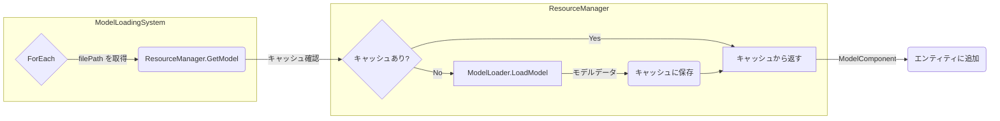

# HEW_ECS フレームワークアーキテクチャ解説

## 1. はじめに

このドキュメントは、`HEW_ECS`フレームワークの内部実装と設計思想について解説する技術資料です。

本フレームワークは、**データ駆動設計** を中心に据えた **Entity Component System (ECS)** アーキテクチャを採用しています。主な目的は、コンポーネントの組み合わせによってゲームオブジェクトの振る舞いを定義することで、柔軟性、再利用性、そしてパフォーマンスを向上させることです。

この資料を読むことで、開発者はフレームワークのコアな部分（アプリケーションのライフサイクル、ECSの仕組み、レンダリングパイプラインなど）を理解し、より高度な機能実装やカスタマイズ、問題解決を効率的に行えるようになることを目指します。

---

## 2. アプリケーションのライフサイクル

アプリケーション全体の流れは `App` 構造体 (`include/app/App.h`) によって管理されています。以下に、起動から終了までの主要なステップを示します。

### 2.1. 起動と初期化 (`WinMain` -> `App::Init`)

アプリケーションのエントリーポイントは `src/main.cpp` の `WinMain` 関数です。

1.  **`App` インスタンス生成**: `WinMain` 内で `App` オブジェクトがスタック上に生成されます。
2.  **`App::Init()` 呼び出し**: 主要な初期化処理がここで行われます。
    -   **ウィンドウ作成**: `CreateAppWindow` でWindows APIを使い、メインウィンドウを生成します。
    -   **グラフィックス初期化**: `InitializeGraphics` で `GfxDevice` (DirectX11デバイス)、`TextureManager`、`RenderSystem` などを初期化します。
    -   **サービスロケータ登録**: `ServiceLocator::Register` を使い、`GfxDevice`, `InputSystem`, `World` などの主要システムをグローバルにアクセス可能にします。
    -   **カメラ設定**: `SetupCamera` でビュー行列とプロジェクション行列を設定します。
    -   **ゲーム初期化**: `InitializeGame` で `SceneManager` を使い、最初のシーン（`GameScene`）を登録・初期化します。

```mermaid
graph TD
    A[WinMain] --> B(App app;)
    B --> C{app.Init()}
    C --> D[ウィンドウ作成]
    C --> E[グラフィックス初期化]
    C --> F[サービスロケータ登録]
    C --> G[カメラ設定]
    C --> H[ゲームシーン初期化]
    H --> I{SceneManager.Init("Game")}
```

### 2.2. メインループ (`App::Run`)

初期化が完了すると、`App::Run()` が呼び出され、メインループが開始します。このループは `WM_QUIT` メッセージを受け取るまで継続します。

ループ内の処理は、大きく分けて3つのフェーズで構成されます。

1.  **メッセージ処理**: `ProcessWindowsMessages` でウィンドウメッセージ（マウス、キーボード、閉じるボタンなど）を処理します。
2.  **更新フェーズ (Update Phase)**:
    -   `InputSystem` と `GamepadSystem` を更新し、現在の入力状態をポーリングします。
    -   `SceneManager::Update` を通じて、現在のシーンの更新ロジック（`OnUpdate`など）を呼び出します。ここでECSの `World::Tick` が実行され、すべての `Behaviour` コンポーネントが更新されます。
3.  **描画フェーズ (Render Phase)**:
    -   `GfxDevice::BeginFrame` でフレームの描画を開始します。
    -   （Debugビルド時）`DebugDraw` を使ってグリッドや軸などのデバッグ情報を描画します。
    -   `RenderSystem::Render` を呼び出し、`World` 内の描画可能なエンティティ（`Transform` と `MeshRenderer`/`ModelComponent` を持つもの）をカメラ(`Camera`)の視点から描画します。
    -   `GfxDevice::EndFrame` で描画内容を画面に表示（Present）します。

```mermaid
graph LR
    subgraph メインループ (App::Run)
        A(開始) --> B{メッセージ処理};
        B --> C(時間計算 Δt);
        C --> D[更新フェーズ];
        D --> E[描画フェーズ];
        E --> F{終了?};
        F -- No --> B;
        F -- Yes --> G(終了);
    end

    subgraph 更新フェーズ
        U1[入力更新] --> U2[シーン更新 (World.Tick)];
    end

    subgraph 描画フェーズ
        R1[BeginFrame] --> R2[デバッグ描画];
        R2 --> R3[シーン描画 (RenderSystem)];
        R3 --> R4[EndFrame];
    end
```

### 2.3. 終了処理 (`App::~App`, `App::Shutdown`)

`WM_QUIT` メッセージによりメインループが終了すると、`App` オブジェクトのデストラクタが呼び出されます。

-   `App::Shutdown()` が呼び出され、初期化と逆の順序で各システムを安全に解放します。
    -   `SceneManager` -> `World` -> `RenderSystem` -> `GfxDevice` の順でシャットダウン処理が行われます。
-   最後に `CoUninitialize` でCOMライブラリを終了します。

---

## 3. ディレクトリ構造

プロジェクトの主要なディレクトリとその役割は以下の通りです。

```
HEW_ECS/
├── Assets/      # 3Dモデル(.fbx), テクスチャ(.png)などのアセット
├── docs/        # プロジェクト関連ドキュメント
├── include/     # ヘッダーファイル (.h)
│   ├── app/         # アプリケーション基盤 (App, ServiceLocator)
│   ├── components/  # ECSコンポーネント定義
│   ├── ecs/         # ECSコア (World, Entity)
│   ├── graphics/    # レンダリング関連 (RenderSystem, GfxDevice)
│   ├── input/       # 入力処理 (InputSystem, GamepadSystem)
│   ├── scenes/      # ゲームシーン (SceneManager, MainGame)
│   └── systems/     # ECSシステム定義
├── libs/        # Assimpなどの外部ライブラリ
├── src/         # ソースファイル (.cpp)
└── tools/       # 補助ツール (ClangFormat実行スクリプトなど)
```

---

## 4. ECSコア詳解 (`World`クラス)

`World`クラス (`include/ecs/World.h`) は、本フレームワークの心臓部です。すべてのエンティティ、コンポーネント、およびそれらの関連ロジックを管理します。

### 4.1. エンティティ管理

エンティティは、単なる一意なIDを持つ「識別子」です。`World`クラスは、このIDの生成、破棄、および有効性の管理を行います。

-   **エンティティの構造 (`Entity`)**
    ```cpp
    struct Entity {
        uint32_t id;   // 識別子
        uint32_t gen;  // 世代 (Generation)
    };
    ```

-   **生成 (`CreateEntity`)**
    -   `World`は内部に `freeIdsReady_` という、過去に破棄されて再利用可能になったIDのリストを保持しています。
    -   `CreateEntity`が呼ばれると、まずこのリストからIDを取得しようと試みます。リストが空の場合、新しいID (`nextId_`) をインクリメントして払い出します。

-   **破棄 (`DestroyEntity`)**
    -   エンティティの破棄は即時には行われません。`DestroyEntity`が呼ばれると、対象のIDが `pendingDestroy_` というキューに追加されます。
    -   実際の破棄処理は、フレームの更新処理がすべて完了した後、`FlushDestroyEndOfFrame()` 内で実行されます。これにより、システムの更新中にエンティティが突然消えてしまう、といった問題を回避しています。

-   **有効性検証 (`IsAlive`) と世代管理**
    -   エンティティを破棄すると、そのIDは `freeIdsReady_` に戻され、将来再利用される可能性があります。もし古いエンティティハンドル（破棄済みの `Entity` オブジェクト）が使われると、意図しない別のエンティティを操作してしまう危険性があります（ABA問題）。
    -   これを防ぐため、`World`は `generations_` という配列で各IDの「世代」を管理します。エンティティが破棄されるたびに、そのIDに対応する世代番号がインクリメントされます。
    -   `IsAlive(entity)` は、IDが現在生存しているか (`alive_` セット) に加え、`entity` が持つ世代番号と `World` が管理する最新の世代番号が一致するかをチェックします。これにより、古いハンドルを安全に無効化できます。

### 4.2. コンポーネント管理

コンポーネントはエンティティに紐づくデータや振る舞いを定義します。

-   **コンポーネントストレージ (`stores_`)**
    -   `World`は内部に `stores_` というマップを持ち、コンポーネントの型 (`std::type_index`) ごとに専用のコンポーネントプール（`Store<T>`）を管理します。
    -   各 `Store<T>` は、エンティティIDからコンポーネントのインスタンス (`std::unique_ptr<T>`) へのマップを保持しています。これにより、型安全かつ効率的にコンポーネントが格納されます。

-   **追加と取得 (`Add`, `TryGet`)**
    -   `Add<T>(entity, ...)`: 指定されたエンティティIDをキーとして、新しいコンポーネントインスタンスを対応する `Store<T>` に追加します。
    -   `TryGet<T>(entity)`: 対応する `Store<T>` から、エンティティIDに紐づくコンポーネントのポインタを取得します。存在しない場合は `nullptr` を返します。

-   **`IComponent` と `Behaviour`**
    -   すべてのコンポーネントは、マーカーインターフェースである `IComponent` を継承します。
    -   `Behaviour` は `IComponent` を継承した特別な基底クラスで、`OnStart()` と `OnUpdate()` という仮想関数を持ちます。
    -   `Behaviour` を継承したコンポーネントは、`World` に追加される際に自動的に `behaviours_` リストに登録され、`World::Tick` の中で毎フレーム `OnUpdate` が呼び出されます。これにより、Unityの `MonoBehaviour` のようなオブジェクトごとの更新処理を簡単に実装できます。

### 4.3. システムの実行

`World`は、コンポーネントに対するロジック（システム）を実行する2つの主要な方法を提供します。

-   **`World::Tick()` (Behaviourシステム)**
    -   `App` のメインループから毎フレーム呼び出されます。
    -   `behaviours_` リストに登録されたすべての `Behaviour` コンポーネントに対し、`OnStart`（初回のみ）と `OnUpdate` を呼び出します。
    -   オブジェクト指向的なアプローチで、個々のエンティティが自身の振る舞いを管理するのに適しています。

-   **`World::ForEach()` (データ指向システム)**
    -   `ForEach<T1, T2, ...>([](Entity e, T1& c1, T2& c2, ...) { ... })` のように使います。
    -   指定されたコンポーネントの組み合わせ（例: `Transform` と `Velocity`）を持つすべてのエンティティを効率的に列挙し、ラムダ式で一括処理を実行します。
    -   特定の関心事（例: 物理演算、描画など）に関連するデータをまとめて処理する、データ指向的なアプローチに適しています。

```mermaid
graph TD
    subgraph World
        A[エンティティ管理<br>- ID生成/破棄<br>- 世代管理]
        B[コンポーネント管理<br>- 型別プール<br>- Behaviour登録]
        C[システム実行<br>- Tick (Behaviours)<br>- ForEach (Data-Oriented)]
    end

    A -- "エンティティはID" --> B
    B -- "コンポーネントはデータ/振る舞い" --> C
```

---

## 5. レンダリングパイプライン

3Dオブジェクトが画面に描画されるまでの一連の流れは、複数のクラスが連携して実現されます。

### 5.1. 主要クラスの役割

-   **`GfxDevice`**: DirectX11のデバイスやスワップチェインといった低レベルなAPIをカプセル化します。フレームの開始 (`BeginFrame`) と終了 (`EndFrame`) を管理します。
-   **`RenderSystem`**: `World`と連携し、描画可能なエンティティを実際に描画する高レベルなシステムです。シェーダー、パイプラインステート、定数バッファなどを管理します。
-   **`Camera`**: ビュー行列とプロジェクション行列を保持し、シーンをどの視点から描画するかを決定します。
-   **描画可能コンポーネント**:
    -   `Transform`: オブジェクトの位置、回転、スケールを定義します。
    -   `MeshRenderer`: キューブなどの基本形状メッシュと、色やテクスチャを指定します。
    -   `ModelComponent`: より複雑な3Dモデルのメッシュデータ（頂点/インデックスバッファ）を保持します。

### 5.2. 描画フロー

毎フレーム、以下の流れで描画処理が行われます。

```mermaid
graph TD
    subgraph App::Run (メインループ)
        direction LR
        Update --> Render
    end

    subgraph Render [描画フェーズ]
        direction TB
        A(GfxDevice::BeginFrame) --> B(RenderSystem::Render);
        B --> C(GfxDevice::EndFrame);
    end

    subgraph RenderSystem::Render
        direction TB
        R1{ForEach<Transform, MeshRenderer>} --> R2[DrawIndexed];
        R3{ForEach<Transform, ModelComponent>} --> R4[DrawIndexed];
    end

    B -- "(world, camera) を渡す" --> R1;
    B -- "(world, camera) を渡す" --> R3;
```

1.  **フレーム開始**: `App::Run` 内で `GfxDevice::BeginFrame()` が呼ばれ、バックバッファ（描画先のメモリ領域）が指定された色でクリアされます。

2.  **`RenderSystem` の実行**: `App::Run` が `RenderSystem::Render(world, camera)` を呼び出します。

3.  **エンティティの列挙**: `RenderSystem` は `world.ForEach<...>()` を使い、描画に必要なコンポーネント（`Transform` と `MeshRenderer`、または `Transform` と `ModelComponent`）の組み合わせを持つエンティティをすべて探し出します。

4.  **描画コマンドの発行**: 発見したエンティティごとに、以下の処理を行います。
    a.  `Transform` コンポーネントからワールド行列を計算します。
    b.  ワールド行列とカメラのビュー・プロジェクション行列を組み合わせてWVP行列を作成します。
    c.  計算した行列や、`MeshRenderer`/`ModelComponent` が持つ色・テクスチャ情報を定数バッファに書き込み、シェーダーに転送します。
    d.  `GfxDevice::Ctx()` で取得したデバイスコンテキストを使い、頂点バッファ、インデックスバッファ、シェーダーなどをグラフィックスパイプラインに設定します。
    e.  `DrawIndexed()` を呼び出し、GPUに対して実際の描画コマンドを発行します。

5.  **フレーム終了**: すべてのエンティティの描画が終わると、`App::Run` が `GfxDevice::EndFrame()` を呼び出します。これにより、完成したバックバッファの内容が画面に表示されます（Present）。

---

## 6. リソース管理

3Dモデルやテクスチャなどのアセットは、`ResourceManager` と `TextureManager` によって効率的に管理されます。これらの管理クラスには、`ServiceLocator` を通じてどこからでもアクセスできます。

### 6.1. Service Locator パターン

`ServiceLocator` は、`GfxDevice` や `ResourceManager` のようなグローバルなシステム（サービス）を一元管理するクラスです。各システムは初期化時に `ServiceLocator::Register()` で自身を登録し、他のクラスは `ServiceLocator::Get<T>()` を使ってそのシステムにアクセスします。これにより、オブジェクトを引数で引き回す必要がなくなり、コードの結合度を下げることができます。

### 6.2. モデルの読み込みとキャッシュ (`ResourceManager`)

3Dモデルの読み込みは、複数のクラスが連携して行われます。

1.  開発者は、エンティティに `Model` コンポーネントを追加します。このコンポーネントは、モデルファイルのパス (`std::string filePath`) のみを保持します。
    ```cpp
    world.Create().With<Transform>().With<Model>("Assets/Models/MyCharacter.fbx");
    ```
2.  `ModelLoadingSystem` (Behaviour) が毎フレーム `World` を監視し、`Model` コンポーネントを持つが `ModelComponent` を持たないエンティティを探します。
3.  発見すると、`ServiceLocator::Get<ResourceManager>()` を呼び出して `ResourceManager` を取得します。
4.  `ResourceManager::GetModel(filePath)` を呼び出します。
    -   **キャッシュヒット**: `ResourceManager` の内部キャッシュ (`modelCache_`) にモデルデータが既に存在する場合、それを即座に返します。
    -   **キャッシュミス**: キャッシュにデータがない場合、`ModelLoader::LoadModel(filePath)` を呼び出してディスクからモデルを読み込みます。読み込んだデータ (`std::vector<ModelComponent>`) をキャッシュに保存してから返します。
5.  `ModelLoadingSystem` は、取得した `ModelComponent` をエンティティにアタッチします。これにより、`RenderSystem` がそのエンティティを描画できるようになります。



### 6.3. テクスチャ管理 (`TextureManager`)

テクスチャも同様に `TextureManager` によってキャッシュされます。`RenderSystem` や `ModelLoader` は、テクスチャが必要になると `TextureManager` に問い合わせ、効率的にリソースを再利用します。

---

## 7. 入力システム

ユーザーからの入力は `InputSystem` (キーボード/マウス) と `GamepadSystem` (ゲームパッド) の2つのクラスによって管理されます。これらのシステムは `App::Run()` のメインループ冒頭で毎フレーム `Update()` が呼ばれ、最新の入力状態をポーリングします。

### 7.1. キーボード・マウス (`InputSystem`)

`InputSystem` は、Windows API の `GetAsyncKeyState` を利用して、256個すべての仮想キーの状態を追跡します。

-   **状態判定**: `Update()` メソッド内で、現在のフレームのキー状態と前フレームの状態を比較し、キーの状態を以下の4つに分類します。
    -   `Down`: このフレームで押された瞬間
    -   `Pressed`: 押され続けている
    -   `Up`: このフレームで離された瞬間
    -   `None`: 押されていない
-   **使用方法**: `PlayerMovement` のような `Behaviour` コンポーネント内から、`ServiceLocator::Get<InputSystem>()` を使ってシステムを取得し、各種メソッドを呼び出します。
    ```cpp
    // in PlayerMovement::OnUpdate(..., float dt)
    auto& input = ServiceLocator::Get<InputSystem>();

    // 押され続けている間、移動
    if (input.GetKey('W')) {
        t->position.z += speed * dt;
    }

    // 押された瞬間にジャンプ
    if (input.GetKeyDown(VK_SPACE)) {
        Jump();
    }
    ```

### 7.2. ゲームパッド (`GamepadSystem`)

`GamepadSystem` は、最新の **XInput** API と、古い規格である **DirectInput** API の両方をサポートし、これらを統合して抽象化されたインターフェースを提供します。

-   **デバイスの自動認識**: `Init()` 時に、まずXInputデバイス（Xboxコントローラーなど）を検出し、次にDirectInputデバイスを空いているスロットに割り当てます。これにより、異なる種類のコントローラーを最大4台までシームレスに扱うことができます。
-   **入力の統合**: `GetLeftStickX()` や `GetButtonDown()` などのメソッドは、接続されているすべてのコントローラーからの入力を合算、あるいはOR条件で評価します。これにより、開発者は個々のコントローラーの種類やスロット番号を意識することなく、「いずれかのコントローラーでAボタンが押された」といった判定を簡単に行えます。
-   **チャージ機能**: スティックが一定以上倒されている時間を計測する独自の「チャージシステム」を内蔵しており、`GetLeftStickChargeAmount()` のような関数で「溜め攻撃」の実装を簡略化できます。

    ```cpp
    // in PlayerMovement::OnUpdate(..., float dt)
    auto& gamepad = ServiceLocator::Get<GamepadSystem>();

    // いずれかのゲームパッドの左スティックで移動
    float moveX = gamepad.GetLeftStickX();
    float moveY = gamepad.GetLeftStickY();
    t->position.x += moveX * speed * dt;
    t->position.z += moveY * speed * dt;

    // いずれかのゲームパッドのAボタンが押されたらアクション
    if (gamepad.GetButtonDown(GamepadSystem::Button_A)) {
        PrimaryAction();
    }
    ```

---

## 8. シーン管理

ゲームの各場面（タイトル、ステージ、リザルトなど）は、「シーン」としてカプセル化され、`SceneManager` によって管理されます。

### 8.1. シーンのインターフェース (`IScene`)

すべてのシーンは、以下のライフサイクルメソッドを持つ `IScene` インターフェースを実装する必要があります。

-   `OnEnter(World& world)`: シーンが開始するときに一度だけ呼ばれます。このシーンで使うエンティティの生成や、システム、リソースの準備などを行います。
-   `OnUpdate(World& world, InputSystem& input, float deltaTime)`: シーンがアクティブな間、毎フレーム呼ばれます。ゲームのメインロジックをここに記述します。
-   `OnExit(World& world)`: シーンが終了するときに一度だけ呼ばれます。`OnEnter` で生成したエンティティを破棄するなど、後片付けを行います。

### 8.2. `SceneManager` の役割

`SceneManager` は、登録されたすべてのシーンを所有し、シーン間の遷移を管理します。

-   **登録**: `App::InitializeGame()` 内で、`sceneManager.RegisterScene("Game", std::make_unique<GameScene>());` のようにして、名前とシーンインスタンスを関連付けます。
-   **更新**: `App::Run()` のメインループから `sceneManager.Update()` が呼ばれ、これが現在アクティブなシーンの `OnUpdate()` を呼び出します。
-   **遷移**: あるシーンから別のシーンに切り替える場合、`ChangeScene()` メソッドが使われます。これは内部で、現在のシーンの `OnExit()` を呼び出した後、次のシーンの `OnEnter()` を呼び出します。

### 8.3. 実装例: `MainGame` シーン

`include/scenes/MainGame.h` は `IScene` の具体的な実装例です。

-   `OnEnter()` では、プレイヤーやライト、各種システム (`ModelLoadingSystem` など) を持つエンティティを `world.Create()` で生成しています。
-   `OnUpdate()` では、`world.Tick(deltaTime)` を呼び出してECSの `Behaviour` を更新しています。
-   `OnExit()` では、このシーンで生成したエンティティを `world.DestroyEntity()` で安全に破棄し、次のシーンに不要なオブジェクトが残らないようにしています。

このように、シーンごとに必要なエンティティとロジックをカプセル化することで、ゲームの各状態を独立して管理でき、見通しの良い設計が可能になります。
